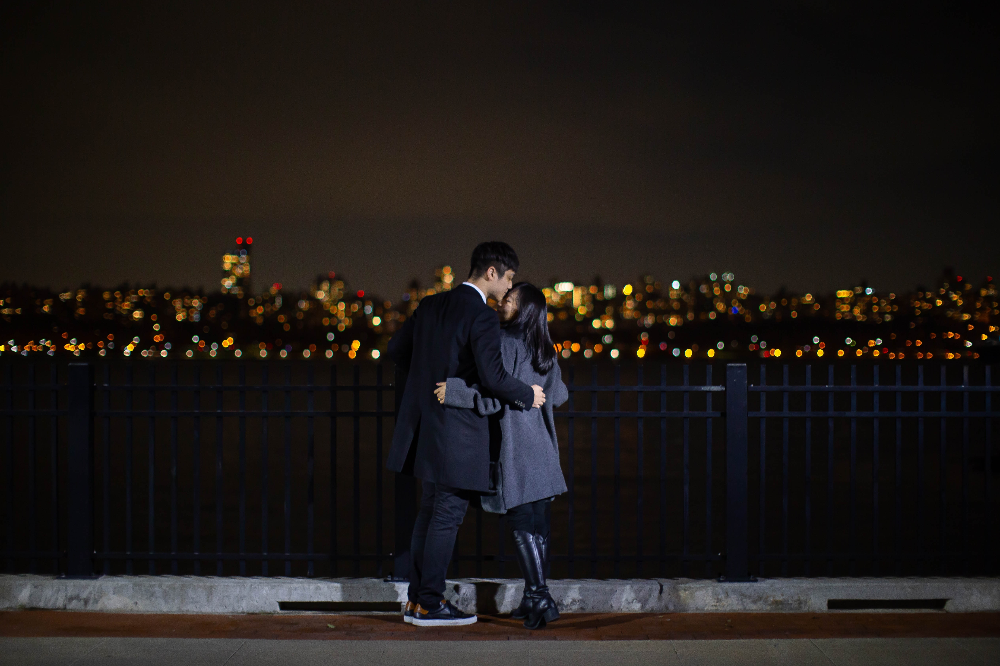

# Project: Image Style Transfer

<p float="left">
  
  
</p>

### [Full Project Description](output/Neural_Style_Transfer_final.pdf)

+ Cho, Sung In sc4393@columbia.edu
	
+ Project summary: In this project, we will use deep learning technique to compose images in a style of another image.  This method is called Neural Style Transfer. For this project, I mainly referred to the paper, [1]Image Style Transfer Using Convolutional Neural Networks (Gatys et al., 2016). Neural style transfer blends two images, a content image and a style reference image, to make an output image that looks like the content image painted in the style of the style reference image. An optimization technique is used to the output image to match the content statistics of the content image and the style statistics of the style reference image. These statistics are extracted from the above images using a convolutional network. We will use VGG19 network in this project. From this project, we want to learn the important steps of Neural Style Transfer and find out the factors that affect an output image the most in a training process.

```
proj/
├── lib/
├── data/
├── doc/
├── figs/
└── output/
```

Please see each subfolder for a README file.
